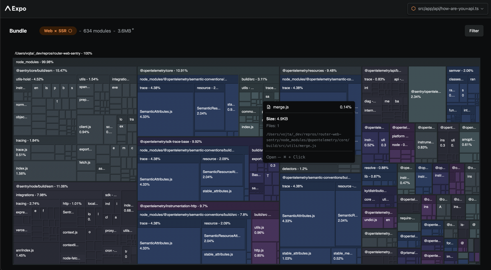

# Repro

There's an error in [here](https://github.com/vonovak/router-web-sentry/blob/be1acdd7f06b91f41ec302b1fdb098612918337c/src/app/api/how-are-you%2Bapi.ts#L2) when importing Sentry. There are no calls to any Sentry functions, just the import itself breaks the app.

Something about how the Sentry package is set up breaks Metro. It seems more likely this is a Metro issue than a Sentry one, and other packages could cause similar issues.

Removing the `import` export [here](https://github.com/getsentry/sentry-javascript/blob/20ce849fec6f246725c6c4507b37fa2d2b871207/packages/node/package.json#L21) works around the issue. Disabling `unstable_enablePackageExports` does not.

- run `yarn web`
- in the website that opens, press the 'SEND A POST TO API' button
- observe error in terminal:

```
Metro error: require is not defined

Call Stack
  <unknown> (file:/Users/vojta/_dev/repros/router-web-sentry/src/app/api/how-are-you+api.ts.bundle%3Fplatform=web&dev=true&hot=false&transform.engine=hermes&transform.routerRoot=src%252Fapp&resolver.environment=node&transform.environment=node&unstable_transformProfile=hermes-stable)
  <unknown> (file:/Users/vojta/_dev/repros/router-web-sentry/src/app/api/how-are-you+api.ts.bundle%3Fplatform=web&dev=true&hot=false&transform.engine=hermes&transform.routerRoot=src%252Fapp&resolver.environment=node&transform.environment=node&unstable_transformProfile=hermes-stable)
  ModuleJobSync.runSync (node:internal/modules/esm/module_job)
  ModuleLoader.importSyncForRequire (node:internal/modules/esm/loader)
  loadESMFromCJS (node:internal/modules/cjs/loader)
  Module._compile (node:internal/modules/cjs/loader)
```

expected: `{ init: [Function: init] }` (works with SDK 52)

### Atlas screenshot




# Expo Router and shadcn

Use [Expo Router](https://docs.expo.dev/router/introduction/) with [Shadcn](https://ui.shadcn.com/) styling on web (Shadcn does not support native).

This template uses Postcss, autoprefixer, and tailwindcss to style the web version of the app. The project is configured to use a root `/src` directory for all source files.

New shadcn components can be added [according to the docs](https://ui.shadcn.com/docs/components/accordion), i.e. by running the CLI: `npx shadcn@latest add accordion`

## 🚀 How to use

Start an Expo app with this template:

```sh
npx create-expo-app -e with-shadcn
```

Or run in the browser with Stackblitz:

<a href="https://stackblitz.com/github/expo/examples/tree/master/with-shadcn">
  
</a>

## Deploy

Deploy on all platforms with Expo Application Services (EAS).

- Deploy the website: `npx eas-cli deploy` — [Learn more](https://docs.expo.dev/eas/hosting/get-started/)
- Deploy on iOS and Android using: `npx eas-cli build` — [Learn more](https://expo.dev/eas)

<!-- <a href="https://expo.dev/eas">
  
</a> -->
